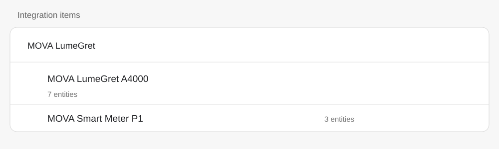
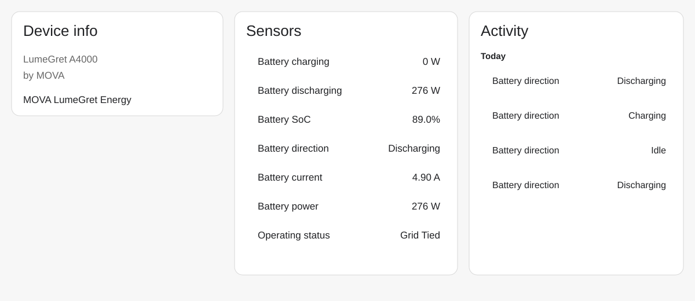
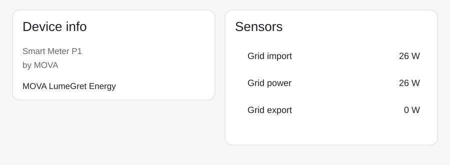

# MOVA LumeGret Energy voor Home Assistant

Onofficiële **read-only** Home Assistant custom integration voor de MOVA LumeGret A4000 en MOVA Smart Meter P1 via de MOVAhome EU-cloud.

> Dit is een communityproject. Het is geen officiële MOVA- of Home Assistant-integratie. Wijzigingen aan firmware of cloud kunnen ervoor zorgen dat de integratie aangepast moet worden.

## Documentatie

- [Nederlandse installatiehandleiding](docs/INSTALLATION_NL.md)
- [Engelse installatiehandleiding](docs/INSTALLATION.md)
- [Ondersteunde apparaten](SUPPORTED_DEVICES.md)
- [Probleemoplossing](TROUBLESHOOTING.md)
- [Veelgestelde vragen](FAQ.md)
- [Architectuur](docs/ARCHITECTURE.md)
- [Dashboard / Energy Dashboard](docs/DASHBOARD.md)
- [Testmatrix en releasechecklist](docs/TEST_MATRIX.md)
- [Roadmap](ROADMAP.md)
- [Bijdragen](CONTRIBUTING.md)
- [Beveiliging](SECURITY.md)

## Getest met

- MOVA LumeGret A4000 (`mova.bkw.ge2505`)
- MOVA B4000 uitbreiding in de gebruikte testopstelling
- MOVA Smart Meter P1 (`mova.sme.ge2608`)
- MOVAhome EU-account
- Home Assistant custom integrations

De B4000 maakt deel uit van de geteste accusamenstelling, maar wordt door deze integratie niet als apart cloudapparaat aangeboden.

## Home Assistant-weergave

De voorbeelden hieronder zijn privacyveilige weergaven op basis van screenshots uit de echte testinstallatie. Privéadressen en niet-gerelateerde persoonlijke automatiseringen zijn bewust weggelaten.

### Integratie-overzicht



### MOVA LumeGret A4000



### MOVA Smart Meter P1



## Bewust read-only

De publieke integratie leest alleen gegevens uit. Er zitten **geen** laad-, ontlaad-, modus- of andere schrijfcommando's in deze publieke versie.

Voor de telemetrie wordt `get_properties` gebruikt. De experimentele schrijf-/EMS-regeling uit de ontwikkelopstelling is bewust niet in deze publieke repository opgenomen.

## Sensoren

### MOVA LumeGret A4000

- Batterij SoC
- Batterijvermogen
- Batterij laden
- Batterij ontladen
- Batterijstroom
- Batterijrichting
- Bedrijfsstatus

### MOVA Smart Meter P1

- Netvermogen
- Netafname
- Teruglevering

Tekenconventie:

- batterijvermogen: positief = ontladen, negatief = laden
- netvermogen: positief = afname, negatief = teruglevering

De cloud wordt in deze versie iedere 10 seconden uitgelezen.

## Installeren

### Via HACS als custom repository

1. Open HACS.
2. Kies via het menu **Custom repositories**.
3. Voeg `https://github.com/drosharold-coder/mova-lumegret-home-assistant` toe.
4. Kies categorie **Integration**.
5. Installeer **MOVA LumeGret Energy**.
6. Herstart Home Assistant.
7. Ga naar **Instellingen -> Apparaten & diensten -> Integratie toevoegen**.
8. Zoek op **MOVA LumeGret Energy**.
9. Log in met hetzelfde MOVAhome-account als in de officiële app.

Voor handmatige installatie, updates en extra uitleg: [Nederlandse installatiehandleiding](docs/INSTALLATION_NL.md).

## Optioneel: Energy Dashboard

In `optional/mova_energy_dashboard.yaml` staat een package dat live laad- en ontlaadvermogen omzet naar cumulatieve kWh-sensoren voor het Home Assistant Energy Dashboard.

Controleer eerst of deze bronentiteiten bij jou bestaan:

```text
sensor.mova_lumegret_a4000_batterij_laden
sensor.mova_lumegret_a4000_batterij_ontladen
```

Zie [Dashboard / Energy Dashboard](docs/DASHBOARD.md) voor de volledige uitleg.

## Privacy en inloggegevens

De integratie vraagt tijdens de setup om het MOVAhome e-mailadres en wachtwoord omdat de huidige koppeling via de MOVAhome-cloud werkt. Deel nooit Home Assistant `.storage`-bestanden, wachtwoorden, tokens, cookies of persoonlijke device-ID's op GitHub.

De publieke repository bevat zelf geen persoonlijk wachtwoord, live access token, refresh token, cookie, persoonlijke device-ID of privé-LAN-adres.

## Beperkingen

- Cloud-afhankelijk; nog geen lokale API.
- Getest met de hierboven genoemde EU-opstelling en model-ID's.
- Deze versie verwacht zowel een A4000 als Smart Meter P1 in hetzelfde MOVAhome-account.
- De gebruikte cloudinterface is niet officieel gedocumenteerd en kan wijzigen.
- Lokale merfafbeeldingen van custom integrations vereisen een recente Home Assistant-versie. Zie je `icon not available`, werk dan eerst Home Assistant bij en installeer/update deze integratie opnieuw voordat je het artwork zelf gaat onderzoeken.

## Doel

Het doel is om MOVA-gebruikers nu al nette Home Assistant-telemetrie te geven, praktijkkennis te delen en een goede basis te maken voor toekomstige officiële MOVA Home Assistant- of lokale API-ondersteuning.

## Versie

Huidige publieke release: **v0.1.3**

Volgende release in voorbereiding: **v0.1.4**

MIT-licentie. MOVA-namen en handelsmerken blijven eigendom van de betreffende rechthebbenden. Eventuele community-afbeeldingen in deze repository zijn geen officieel MOVA-logo.
