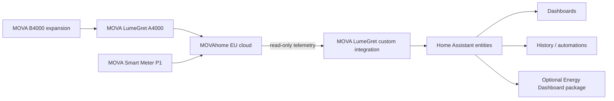

# Architecture

The public project is intentionally simple and read-only.

## Data path

1. The A4000 and Smart Meter P1 report data through the MOVAhome ecosystem.
2. The Home Assistant integration authenticates with the user's MOVAhome EU account.
3. The integration polls telemetry from the cloud.
4. The coordinator maps returned properties to Home Assistant sensor entities.
5. Home Assistant can use those entities for dashboards, history and local automations.
6. The optional package derives cumulative battery energy values for the Energy Dashboard.

## Read-only boundary

The public cloud client is limited to reading telemetry (`get_properties`). Charging, discharging, operating-mode changes and other write/control commands are intentionally outside this repository.

## Cloud dependency

This architecture currently depends on internet access and the MOVAhome EU cloud. If MOVA provides an official/documented local API in the future, a local architecture would be preferable because it can reduce latency and cloud dependency.

## Privacy boundary

Credentials are entered in the Home Assistant config flow and stored by Home Assistant. They must never be committed to GitHub. Screenshots, logs and diagnostics should be sanitized before publication.
