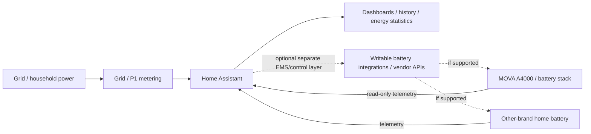

# Multi-brand battery setups with Home Assistant

This project can be used as one building block in a Home Assistant installation that also contains a home battery from another manufacturer.

The important distinction is that this does **not** mean MOVA officially supports or directly pairs with another battery brand. The batteries can coexist in the same Home Assistant energy setup, while Home Assistant provides the common visibility and—if separate writable integrations are available—the higher-level coordination.

## What is supported by this public integration

The MOVA LumeGret integration in this repository is deliberately **read-only**.

It can provide Home Assistant with telemetry from the tested MOVA setup, including:

- battery state of charge
- battery power
- charge/discharge power
- battery current
- operating direction/status
- Smart Meter P1 grid import/export telemetry

Home Assistant can show this telemetry next to data from another battery brand in the same dashboards, history, statistics and automations.

## What this does not claim

This documentation does **not** claim that:

- MOVA officially supports a specific third-party battery brand;
- MOVA and another battery communicate directly with each other;
- this public integration controls charging or discharging;
- every combination of battery systems is automatically safe or conflict-free;
- a particular third-party model has been validated unless it is explicitly listed as tested.

## Recommended architecture

The public MOVA integration remains on the telemetry side of this diagram. Any writable control or experimental EMS logic should be kept separate from this repository.

## Why central coordination matters

Two battery systems that each make their own decisions from grid power can react to the same event at the same time. Without a clear strategy, one battery may charge while another discharges, both may respond to the same import/export signal, or their control loops may keep correcting each other.

A multi-battery setup should therefore have one clear coordination strategy. Typical approaches are:

1. **Monitoring only** — both batteries keep their own vendor control, while Home Assistant only monitors them.
2. **Priority control** — one battery is the primary system and the second battery only acts under specific conditions.
3. **Central EMS** — a separate Home Assistant/EMS layer decides which battery may charge or discharge and when.

The third option requires writable and sufficiently reliable interfaces for the batteries involved. That functionality is intentionally outside the public read-only MOVA integration.

## Practical design rules

For a stable multi-brand installation:

- use one consistent grid-power reference where possible;
- define one owner for each control decision;
- avoid two independent zero-export or self-consumption controllers fighting over the same meter signal;
- use explicit charge/discharge priorities;
- define minimum and maximum state-of-charge limits per battery;
- include deadbands/hysteresis so small power fluctuations do not cause rapid switching;
- fail safely if Home Assistant, the network or a cloud API becomes unavailable;
- respect each manufacturer's electrical, thermal and warranty requirements;
- have mains wiring and protection designed/checked by a qualified installer where required.

## Example use case

A household may have:

- a MOVA LumeGret A4000 with B4000 expansion;
- a MOVA Smart Meter P1;
- a second home battery from another manufacturer;
- Home Assistant as the common monitoring and energy-management layer.

Home Assistant can then combine both systems in one overview. If both systems also have suitable writable integrations, a separate EMS can coordinate them so they do not work against each other.

Again: the cross-brand coordination is a **Home Assistant / EMS use case**, not an official MOVA-to-third-party battery protocol.

## When can a combination be called "tested"?

A specific combination should only be marked as tested after checking at least:

- both systems report stable telemetry;
- grid import/export has the expected sign and scale;
- charging one battery does not trigger unwanted discharge from the other;
- discharging one battery does not trigger unwanted charging from the other;
- state-of-charge limits are respected;
- behavior after a Home Assistant restart is predictable;
- behavior after internet/cloud/API loss is safe;
- the system returns to a known state after communication recovers.

Until those checks are completed for a specific second battery model, describe the setup as **multi-brand capable through Home Assistant architecture**, not as a validated MOVA compatibility claim.

## Public-project boundary

This repository will continue to keep the MOVA integration itself read-only. Multi-battery control examples may be documented conceptually, but experimental write commands, private reverse-engineering details, credentials and personal device identifiers do not belong in the public integration.